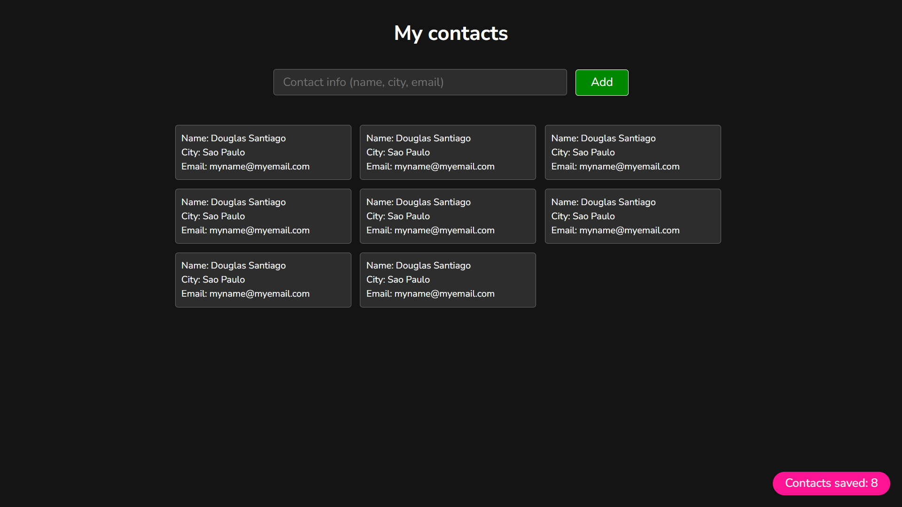

# Contact list application

Welcome to the Contact List Application! This project is a simple yet efficient 
tool for storing and managing contact information. Built using HTML, CSS, and 
JavaScript, the application allows users to easily add, view, and delete 
contacts.

Visit the website [here](!!!!!!!!!!!!adicionar site aqui) 



## Features 

Contact Manager Application offers a range of features to help you efficiently 
manage your contacts:

Add Contacts: Easily add new contacts by entering their name, city, and email 
address. This ensures you have all essential information at your fingertips.

View Contacts: View all your saved contacts in a well-organized, easy-to-read 
format. Contacts are displayed with their name, city, and email for quick 
reference.

Delete Contacts: Quickly delete any contact by simply clicking on the contact 
entry. This feature ensures that your contact list remains up-to-date and 
clutter-free.

Real-Time Updates: The application provides real-time updates to the contact 
count, so you always know how many contacts you have saved.

Validation Alerts: Built-in validation alerts prompt you to enter required 
information correctly, ensuring the integrity and completeness of your contact 
data.

This application is designed to be user-friendly and efficient, making it easy 
for you to manage your contacts with minimal effort.
 
## Get Started

**To get started locally:**

Clone this repo:

```bash
git clone !!!!!!!!!!!!!!!!colocar o clone aqui
cd n!!!!!!!!!!!!!!!!!!!!!!nome do repositorio aqui
```
Explore the different files.

Select the index.html file.

Do right-click and select the `Reveal in File Explorer` menu.

Double-click on file index.html.

Through the top menu, you can navegate to the other web pages, such as 
About us and Contact us:
<br/>